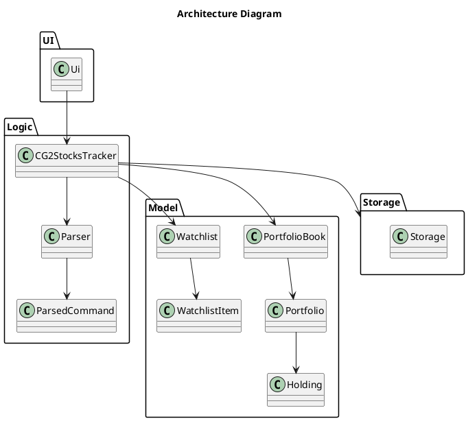
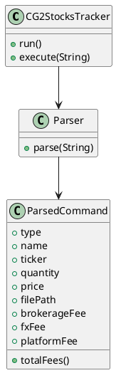
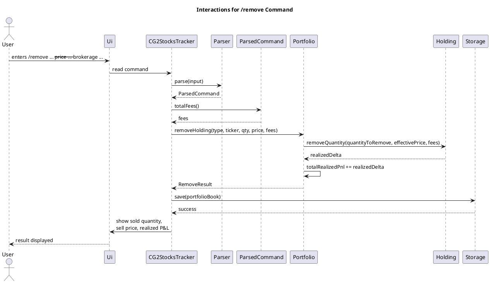
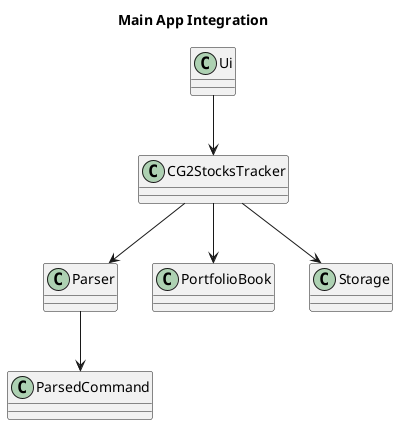
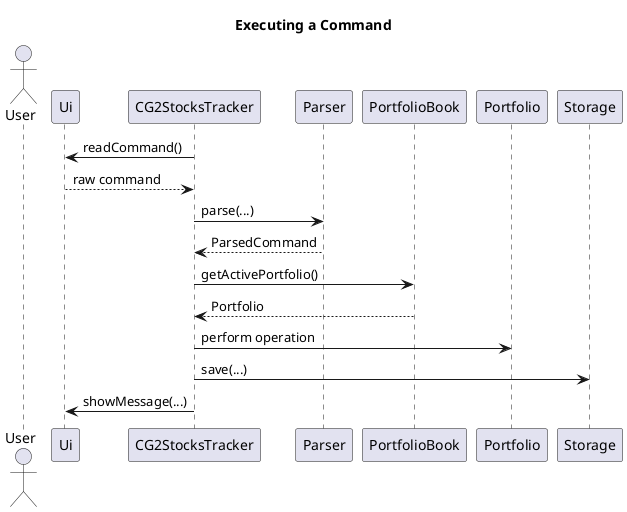
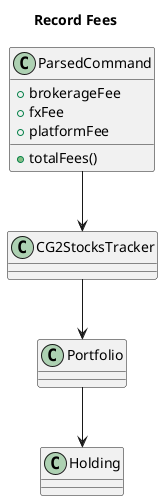
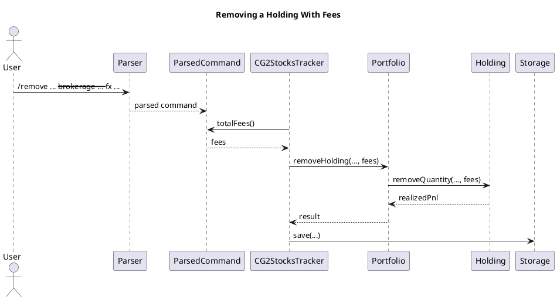

# Developer Guide

## Acknowledgements

{list here sources of all reused/adapted ideas, code, documentation, and third-party libraries -- include links to the original source as well}

## Design & implementation


# Developer Guide


## Design

### Architecture

The Architecture Diagram above gives an overview of the main components in the application and how they interact.

The application consists of four main components:

- **UI**: Handles user input and output

- **Logic**: Executes commands

- **Model**: Stores application data in memory

- **Storage**: Reads and writes data to disk


The `CG2StocksTracker` class acts as the main entry point of the application. It is responsible for initializing these components and coordinating the execution of commands.

---

### How the components interact

When a user enters a command, the flow is as follows:

1. The command is read by `Ui`

2. The command string is passed to `CG2StocksTracker`

3. `Parser` parses the command and returns a `ParsedCommand`

4. `CG2StocksTracker` executes the command using the Model

5. If the command modifies data, `Storage` saves the updated state

6. The result is returned to `Ui` for display


---

### Architecture Diagram



---

## UI Component

### Overview

The API of this component is specified in `Ui.java`.

The `Ui` component is responsible for interacting with the user. It reads input commands and displays results or error messages.

---

### How the UI works

- `Ui` reads user input as a string

- It forwards the input to `CG2StocksTracker`

- It displays the output returned by the application


The UI does not perform any parsing or business logic.

---

## Logic Component

### Overview

The command parsing subsystem is responsible for translating raw user input strings into structured, type-safe command objects that the rest of the application can act upon. It is composed of three tightly related classes: `CommandType`, `ParsedCommand`, and `Parser`. Together, they form a clean separation between the *syntax* of a command (what the user typed), the *semantics* of a command (what it means), and the *dispatch* of a command (what should happen).

---

### Architecture-Level Description

At the architecture level, the parsing subsystem sits between the user interface layer and the application logic layer. The main application loop in `CG2StocksTracker` reads a raw string from `Ui`, hands it to `Parser`, and receives back a `ParsedCommand`. The application then switches on the `CommandType` contained within that `ParsedCommand` to decide which handler to invoke.

This design keeps the application loop simple: it never inspects raw strings itself, and it never needs to know how options are encoded. All of that knowledge is encapsulated in `Parser`.

---

### Component-Level Description

#### `CommandType` — The Command Vocabulary

`CommandType` is a Java `enum` that enumerates every command the application understands:

```
CREATE, USE, LIST, ADD, REMOVE, WATCH, SET, SET_MANY, VALUE, INSIGHTS, HELP, EXIT
```

Its role is to serve as the single authoritative list of valid commands. Using an enum instead of raw strings eliminates
an entire class of bugs: a typo like `"CREAT"` is caught at compile time rather than causing a silent mismatch at
runtime. It also makes exhaustive `switch` statements possible — the compiler can warn if a new `CommandType` value is
added but not handled.

**Design decision:** The enum is kept intentionally minimal — it carries no behaviour, no labels, and no metadata. This
keeps the command vocabulary cleanly decoupled from parsing logic and from execution logic. An alternative considered
was storing a display name or usage string inside the enum. This was rejected because it would mix concerns; usage
strings belong in `Ui`.

---

#### `ParsedCommand` — The Data Transfer Object

`ParsedCommand` is a Java `record` that carries all the information the application needs to execute a command:

```java
public record ParsedCommand(
    CommandType type,
    String name,
    AssetType assetType,
    String ticker,
    Double quantity,
    Double price,
    Double brokerageFee,
    Double fxFee,
    Double platformFee,
    String listTarget,
    Path filePath
)
```

Records in Java are implicitly immutable and generate `equals`, `hashCode`, and `toString` automatically. This makes
`ParsedCommand` safe to pass around without defensive copying.

Not every field is populated for every command. For example, a `VALUE` command needs no fields beyond `type`, while an
`ADD` command needs `assetType`, `ticker`, `quantity`, and may optionally include fee fields. Fields that are not
applicable for a given command are simply `null`.

`ParsedCommand` also exposes `totalFees()`, which combines `brokerageFee`, `fxFee`, and `platformFee` into one value
before command execution.

**Design decision:** A single record with nullable fields was chosen over a class hierarchy (e.g. a `CreateCommand
extends ParsedCommand` pattern). The hierarchy approach would have been more type-safe in principle, but for a CLI
application of this scale, the added boilerplate outweighs the benefit. The flat record is simpler to construct, simpler
to test, and straightforward to extend when new commands are added.

**Alternative considered:** Using `Optional<T>` instead of nullable fields. This was considered to make the "may be
absent" contract explicit, but Java records with `Optional` fields carry more syntactic overhead at construction sites
(e.g., `Optional.of(...)`, `Optional.empty()`) which clutters the `Parser` code without adding meaningful safety at this
scale.

---

#### `Parser` — The Core Logic

`Parser` is a stateless class with a single public entry point:

```java
public ParsedCommand parse(String input) throws AppException
```

Internally, parsing proceeds in two stages: **tokenisation** and **command-specific parsing**.

##### Stage 1: Tokenisation

The `tokenise` method splits the input string on whitespace, with support for double-quoted tokens. This allows
arguments containing spaces (such as a portfolio name like `"My Portfolio"`) to be passed as a single token.

The tokeniser iterates character by character, tracking an `inQuotes` boolean flag. When the flag is active, whitespace
is treated as a regular character rather than a delimiter. An unclosed quote is detected at the end of the loop and
raises an `AppException`.

For example, the input `/add --type stock --ticker "BRK A" --qty 10` produces the token list `["/add", "--type",
"stock", "--ticker", "BRK A", "--qty", "10"]`.

**Design decision:** A hand-written character-by-character tokeniser was used rather than `String.split()` or a regular
expression, because neither handles quoted tokens natively without significant complexity. A proper lexer library was
not used because the grammar is simple enough that the overhead of a dependency is not justified.

##### Stage 2: Command-Specific Parsing

After tokenisation, the first token (the command word, e.g. `/add`) is extracted and matched using a `switch`
expression. Each `case` delegates to a dedicated private method:

```java
return switch (commandWord) {
    case "create" -> parseCreate(tokens);
    case "add"    -> parseAdd(tokens);
    case "set"    -> parseSet(tokens);
    // ...
};
```

Commands that accept named options (e.g. `--type`, `--ticker`, `--qty`) go through `parseOptions`, which reads tokens in
key-value pairs and populates a `Map<String, String>`. The helper `requireOption` then asserts that a required key is
present, throwing a descriptive `AppException` if it is missing.

For `/add` and `/remove`, the parser also reads optional fee fields such as `--brokerage`, `--fx`, and `--platform`.

Two additional helpers enforce type safety: `parsePositiveDouble` parses a string to a `double` and asserts it is
strictly positive (used for `--qty`, `--price`, and fee fields), while `normaliseTicker` uppercases the ticker string so
that `aapl` and `AAPL` are treated identically regardless of how the user typed them.

---

### Sequence Diagram: Parsing a `/add` Command

The following sequence diagram illustrates what happens when the user types `/add --type stock --ticker AAPL --qty 10`.

<!-- INSERT SEQUENCE DIAGRAM 1 HERE -->

---

### Sequence Diagram: Handling an Invalid Command

The following shows what happens when the user enters a malformed command, such as `/add --type stock` (missing
`--ticker` and `--qty`). The `AppException` thrown by `requireOption` propagates back to `CG2StocksTracker.run()`, which
catches it and routes it to `Ui.showError()`. This ensures that all user-facing errors are displayed consistently
regardless of which stage of parsing failed.

<!-- INSERT SEQUENCE DIAGRAM 2 HERE -->

---

### Error Handling Strategy

All parsing errors are reported via `AppException`, a checked application-specific exception. This was a deliberate
choice over using unchecked exceptions: callers are forced by the compiler to handle or propagate the exception, making
it impossible to accidentally swallow a parse error. The messages in `AppException` are written in plain English and
include usage hints (e.g., `"Usage: /add --type TYPE --ticker TICKER --qty QTY"`), making them suitable for direct
display to the user.

---

### Alternatives Considered

| Design Choice | Chosen Approach | Alternative | Reason for Choice |
|---|---|---|---|
| Command representation | `enum CommandType` | String constants | Compile-time safety, exhaustive switch |
| Parsed data container | Java `record` (flat) | Class hierarchy per command type | Simpler code, adequate for scale |
| Optional fields | Nullable fields | `Optional<T>` fields | Less construction-site boilerplate |
| Tokenisation | Hand-written char loop | `String.split` / regex | Handles quoted tokens naturally |
| Error signalling | Checked `AppException` | Unchecked `RuntimeException` | Forces callers to handle errors |

---

### Summary

The parsing subsystem deliberately keeps each class narrowly focused. `CommandType` is the vocabulary. `ParsedCommand`
is the data carrier. `Parser` is the translation logic. No class bleeds into the other's responsibility. This separation
means that adding a new command in the future requires only: adding a value to `CommandType`, adding a `case` to
`Parser.parse()` with a corresponding `parseX()` method, and adding a handler in `CG2StocksTracker.execute()`. No other
files need to change.

### Class Diagram



---

### Design considerations

The application uses a single `ParsedCommand` class instead of separate command classes.

This approach was chosen because:

- It keeps the number of classes small

- It simplifies the parsing process


However, it means that adding new commands requires modifying existing code instead of adding new classes.

---


## Model Component

### Overview

The Model component stores all application data in memory.

Its main classes are:

- `PortfolioBook`: stores all portfolios and tracks which one is active

- `Portfolio`: stores holdings and portfolio-level P&L values

- `Holding`: represents a single asset

- `Watchlist`: stores assets the user is monitoring but has not bought yet

- `WatchlistItem`: stores watchlist asset type, ticker, and optional target price


---

### Runtime integration

`CG2StocksTracker` mainly talks to `PortfolioBook`:

- Commands like `/create` and `/use` call `PortfolioBook`

- Commands that change holdings (`/add`, `/remove`, `/set`) first get the active `Portfolio` from `PortfolioBook`
  (`/set` supports both ticker-level updates and type+ticker updates)

- Watchlist commands (`/watch add`, `/watch remove`, `/watch list`, `/watch buy`) call `Watchlist`

- `Storage` rebuilds both portfolio state and watchlist state during load


---

### `PortfolioBook` behavior (simple view)

`PortfolioBook` is the top-level container for portfolios.

Key behavior:

- Keeps portfolios in a map keyed by portfolio name

- `createPortfolio(name)` fails if the name already exists

- The first created portfolio becomes active automatically

- `usePortfolio(name)` switches active portfolio, but fails if the name does not exist

- `getActivePortfolio()` fails when no active portfolio is selected

- `ensurePortfolioExists(name)` creates the portfolio only when missing (used by storage loading)

- `getPortfolios()` returns a copy list so callers cannot directly edit internal map state


---

### `Portfolio` behavior (simple view)

`Portfolio` manages holdings for one portfolio and tracks cumulative realized P&L.

Key behavior:

- Holdings are stored by a composite key: `assetType + "|" + ticker`

- `addHolding(...)`:
Creates a new holding when missing, or updates an existing holding when the same key already exists.
Fees are included in cost basis, so average buy price stays accurate.

- `removeHolding(...)`:
Validates holding existence and quantity, decides effective sell price, computes realized P&L, updates cumulative realized P&L, and removes the holding when quantity reaches zero.

- Sell price priority in `removeHolding(...)`:
1. Use explicit `--price` if provided.
2. Else use holding `lastPrice` (from `/set` or restored/initial stored price).
3. If still unavailable, fail.

- `setPriceForHolding(type, ticker, price)` updates one specific holding by type and ticker.

- `setPriceForTicker(ticker, price)` is used for ticker-level updates (for example `/setmany` and `/set` without type).

- `getCurrentTotalValue()` and `getTotalUnrealizedPnl()` sum only holdings that currently have a price.


---

### `Watchlist` behavior (simple view)

`Watchlist` manages items users may buy later.

Key behavior:

- Each item is keyed by `assetType + "|" + ticker` (no duplicates).

- `addItem(...)` stores an item with optional price.

- `removeItem(...)` deletes a specific item by type and ticker.

- `buyItem(...)` enforces two rules:
1. The item must already have a price.
2. The user must provide an existing target portfolio name.

- On successful `buyItem(...)`, 1 unit is added to the target portfolio at the stored watchlist price, and the item is removed from the watchlist.


---

### Design considerations

Aspect: How portfolio state is organized.

**Alternative 1 (current choice):** Keep a `PortfolioBook` that owns all portfolios and active-portfolio selection.
Pros: Clear single entry point for portfolio-level operations.
Cons: Controller still needs to fetch active portfolio before holding operations.

**Alternative 2:** Let controller manage multiple standalone `Portfolio` objects directly.
Pros: Fewer model classes.
Cons: Active-portfolio tracking logic gets spread across controller code.

Aspect: How realized P&L is handled.

**Alternative 1 (current choice):** Maintain running realized P&L in `Portfolio`.
Pros: Fast reads for `/value` and easy persistence.
Cons: Must update correctly on every sell path.

**Alternative 2:** Recompute realized P&L from transaction history every time.
Pros: Easier auditing of historical trades.
Cons: Requires storing full trade history and adds complexity.


---

## Storage Component

### Overview

The API of this component is specified in `Storage.java`.

`Storage` handles four persistence tasks:

- Load saved data into memory when the app starts

- Save the latest in-memory data back to file after state-changing commands

- Load and save watchlist data

- Read CSV files for `/setmany` and return a summary of what succeeded/failed


---

### Runtime integration

`Storage` is used by `CG2StocksTracker` at two points:

- On startup (`new CG2StocksTracker(...)`), `storage.load()` initializes the `PortfolioBook` and `storage.loadWatchlist()` initializes `Watchlist`

- After successful state-changing commands (`create`, `add`, `remove`, `set`, `setmany`, `watch add`, `watch remove`, `watch buy`), `storage.save(portfolioBook)` and `storage.saveWatchlist(watchlist)` persist state

This keeps command flow in the controller, while file format and file checks stay inside `Storage`.


---

### Save file format

The save file uses one record per line, separated by `|`:

- `ACTIVE|<portfolioName>`

- `PORTFOLIO|<name>|<totalRealizedPnl>`

- `HOLDING|<portfolioName>|<assetType>|<ticker>|<quantity>|<averageBuyPrice>|<lastPrice>`

Watchlist data is stored in a separate file with one record per line:

- `WATCH|<assetType>|<ticker>|<price>`


Notes:

- `ACTIVE|` with an empty second field means there is no active portfolio.

- For unpriced holdings, `lastPrice` is stored as an empty field.

- Older holding rows with 6 fields are still supported:
`HOLDING|<portfolioName>|<assetType>|<ticker>|<quantity>|<restoredPrice>`.

- For these older rows, `restoredPrice` is used as both `lastPrice` and `averageBuyPrice`.

- For watchlist rows, `price` is optional; an empty field means no price is set.


---

### Key methods and behavior

`load()`:

- Ensures the file exists via `createFileIfMissing()`

- Reads all lines and handles each record type (`ACTIVE`, `PORTFOLIO`, `HOLDING`)

- Rebuilds portfolios and holdings using `PortfolioBook` and `Portfolio.restoreHolding(...)`

- Applies the active portfolio only after all records are parsed


`save(PortfolioBook)`:

- Rebuilds the whole save file from current in-memory state

- Persists cumulative realized P&L at portfolio level

- Persists quantity, average buy price, and optional last price for each holding

- Writes all lines using `Files.write(...)`


`loadPriceUpdates(Path, Portfolio)`:

- Validates file existence/type and enforces CSV header `ticker,price`

- Parses each row and updates matching holdings with `Portfolio.setPriceForTicker(...)`

- Accumulates both success and per-row failure details in `BulkUpdateResult`


`loadWatchlist()` / `saveWatchlist(Watchlist)`:

- Uses a separate file at `<main-storage-file>.watchlist`

- Loads and saves watchlist items with optional prices

- Validates watchlist file structure independently from portfolio storage


---

### Error handling strategy

- Invalid save-file structure/content is reported as `Corrupted storage file.`

- File-system failures surface operation-specific messages such as `Unable to create storage file.`, `Unable to read storage file.`, `Unable to save storage file.`, and `Unable to read CSV file.`

- Watchlist persistence uses similar operation-specific messages (create/read/save watchlist storage file)

- CSV row-level errors do not stop the whole batch; they are collected in `BulkUpdateResult.failures()`


---

### Design considerations

Aspect: Where CSV batch update logic should live.

**Alternative 1 (current choice):** Keep CSV parsing and file I/O in `Storage`.
Pros: Keeps `Parser` focused on command syntax and keeps file checks in one place.
Cons: `Storage` handles both persistence and batch import responsibilities.

**Alternative 2:** Parse CSV in `Parser` or controller.
Pros: Reduces surface area of the `Storage` class.
Cons: Mixes command parsing with file parsing and repeats validation logic.


---

# Implementation

---

## Command execution

This section describes how commands are executed in the application.

---

### Sequence Diagram

---

### Explanation

This diagram shows the general flow for all commands.

The important points are:

- All commands go through `CG2StocksTracker`

- Parsing is handled separately by `Parser`

- The Model performs the actual operation

- Storage is only involved when data changes


---

## Create portfolio

### Implementation

The `create` command creates a new portfolio.

Steps:

1. Command is parsed into `ParsedCommand`

2. `CG2StocksTracker` calls `PortfolioBook.createPortfolio(name)`

3. The new portfolio is added

4. If no active portfolio exists, it is set as active

5. The updated state is saved

6. A message is displayed


---

### Sequence Diagram

---

### Explanation

This diagram shows a simple state-changing command.

The main point is that:

- Portfolio creation is handled by `PortfolioBook`

- The controller does not manage internal data structures

- The state is saved immediately after modification


---

## Add holding

### Implementation

The `add` command adds a holding to the active portfolio.

Steps:

1. Retrieve active portfolio

2. `CG2StocksTracker.handleAdd(...)` reads `ParsedCommand.totalFees()`

3. Call `Portfolio.addHolding(...)`

4. Update existing holding or create new one

5. If the holding already exists, recalculate average buy price using weighted average cost

6. If fees are provided, include them in the effective purchase cost

7. Save state

8. Display result


---

### Explanation

The logic is handled inside `Portfolio` and `Holding` to ensure that:

- Holdings are managed consistently

- Average buy price is updated correctly

- Fees are incorporated into cost basis

- The controller does not duplicate logic


---

## Delete holding

### Implementation

The `remove` command removes a holding.

If the holding does not exist, an error is returned.

When the holding exists, the system computes realized P&L using the holding's stored average buy price and updates the portfolio's cumulative realized P&L before saving the updated state. If fees are provided, they are deducted from realized profit/loss.

---

### Sequence Diagram



---

### Explanation

This diagram shows the main flow for the `/remove` command.

The important points are:

- `ParsedCommand` aggregates fee fields

- `Holding` computes realized P&L using average buy price and deducts fees

- `Portfolio` updates cumulative realized P&L

- The updated state is saved immediately after modification


This ensures that invalid operations do not modify the system state.

---

## Cost basis and P&L tracking

This section describes some noteworthy details on how cost basis persistence and P&L calculation are implemented.

### Implementation

The cost basis and P&L tracking mechanism is facilitated by `Holding`, `Portfolio`, and `Storage`.

- `Holding` stores the asset type, ticker, quantity, last price, and average buy price.
- `Portfolio` stores all holdings in a portfolio and keeps track of cumulative realized P&L.
- `Storage` saves and restores the information required for accurate P&L calculation across application restarts.

When the user executes the `/add` command for an existing holding, the holding does not create a separate transaction record. Instead, the system updates the existing holding’s quantity and recalculates its average buy price using weighted average cost.

If fees are provided, they are included in the effective purchase cost.

The formula used is:

`newAvg = (oldQty * oldAvg + addedQty * (addedPrice + fees / addedQty)) / (oldQty + addedQty)`

When the user executes the `/remove` command, the system computes realized P&L using the holding’s stored average buy price.

If fees are provided, they are deducted from the realized P&L.

The formula used is:

`realizedPnl = (sellPrice - averageBuyPrice) * quantitySold - fees`

Unrealized P&L is computed from the last saved market price:

`unrealizedPnl = (lastPrice - averageBuyPrice) * quantity`

To ensure correctness across sessions, the Storage component persists:

- portfolio realized P&L
- holding quantity
- holding average buy price
- holding last price

During loading, the system reconstructs holdings using the stored average buy price instead of inferring cost basis from market price. This prevents incorrect gains/losses after restarting the application.

Legacy storage files are still supported. If an older holding record does not contain a separate average buy price field, the stored price is used as both the restored market price and the restored average buy price.

### Sequence Diagram

The following sequence diagram shows how the `/remove` command updates realized P&L and persists the updated state.


### Design considerations

Aspect: How cost basis is tracked.

**Alternative 1 (current choice):** Store average buy price directly in each `Holding`.
Pros: Simple to implement and efficient for portfolio-level P&L calculations.
Cons: Does not preserve full transaction history.

**Alternative 2:** Store every buy transaction separately and derive cost basis when needed.
Pros: More detailed and extensible for future analytics.
Cons: More complex to implement and unnecessary for the current feature scope.

Aspect: How P&L is restored after restart.

**Alternative 1 (current choice):** Persist `averageBuyPrice`, `lastPrice`, and realized P&L in storage.
Pros: Ensures gains/losses remain correct after reload.
Cons: Requires a richer storage format.

**Alternative 2:** Recompute values from market price only during loading.
Pros: Simpler storage format.
Cons: Incorrect because market price is not the same as cost basis.

---

## Bulk price update

### Implementation

The `setmany` command updates prices using a CSV file.

Steps:

1. Parse file path

2. Call `Storage.loadPriceUpdates(...)`

3. Process each row

4. Update holdings

5. Return summary


---

### Sequence Diagram

---

### Explanation

The loop in this diagram represents processing multiple rows.

The key idea is that:

- Batch processing is handled in `Storage`

- The controller does not handle iteration logic


---

## Main app integration

### Implementation

The `CG2StocksTracker` class is the main integration point of the application.

It is responsible for:

- creating the main components (`Ui`, `Parser`, `Storage`, and `PortfolioBook`)

- loading saved data at startup

- running the main command loop

- dispatching parsed commands to the correct handler

- saving data after state-changing commands


This keeps the responsibilities of the other classes small:

- `Ui` handles input and output

- `Parser` converts raw text into `ParsedCommand`

- `PortfolioBook` and `Portfolio` handle domain logic

- `Storage` handles file persistence


---

### Class Diagram



---

### Sequence Diagram



---

### Explanation

This diagram shows the overall flow of a state-changing command.

The important points are:

- `CG2StocksTracker` controls the command flow

- parsing is separated from execution

- the model performs the actual update

- `Storage` is called only after a successful modification


---

### Design considerations

The main application flow is coordinated in one class instead of being split across `Ui`, `Parser`, and the model.

This approach was chosen because:

- command handling stays in one place

- errors can be handled consistently in the main loop

- save operations are easier to control


An alternative was to let `Ui` call model methods directly.

This was not used because it would mix input handling, command dispatch, and business logic in the same component.

---

## Record fees

### Implementation

The `record fees` enhancement extends `/add` and `/remove` so that a user can include:

- `--brokerage`

- `--fx`

- `--platform`


These values are parsed as optional fields and stored in `ParsedCommand`.

`ParsedCommand.totalFees()` combines the three fields into one value before the command is executed.

For `/add`:

1. `Parser.parseAdd(...)` reads the optional fee fields

2. `CG2StocksTracker.handleAdd(...)` gets the total fee amount

3. `Portfolio.addHolding(...)` updates the holding

4. the fee is included in the holding's average buy price


For `/remove`:

1. `Parser.parseRemove(...)` reads the optional fee fields

2. `CG2StocksTracker.handleRemove(...)` gets the total fee amount

3. `Portfolio.removeHolding(...)` removes the quantity sold

4. `Holding.removeQuantity(...)` deducts the fee from realized profit/loss


This allows portfolio performance to reflect transaction costs instead of using only raw buy and sell prices.

---

### Class Diagram



---

### Sequence Diagram



---

### Explanation

This diagram shows how fees are included in a sell transaction.

The important points are:

- fee fields are parsed together with the command

- the controller passes only the total fee amount to the model

- realized profit/loss is calculated inside `Holding`

- the updated portfolio state is saved after the operation


---

### Design considerations

Fees are stored separately in `ParsedCommand`, but the model uses only the combined fee amount.

This approach was chosen because:

- the command format remains clear to the user

- the model stays simple

- fee handling logic is reused for both buy and sell commands


For buys, fees are added into the effective purchase cost.

For sells, fees are deducted from realized profit/loss.

An alternative was to introduce a separate `Trade` class to store every transaction and fee category in full detail.

This was not used because the current application stores aggregate holdings instead of a full transaction history.

---

# Design Considerations

---

## Command handling

Using `ParsedCommand` simplifies the system but reduces extensibility.

---

## Error handling

Exceptions are used to ensure that errors are not ignored.

---


## Product scope
### Target user profile

{Describe the target user profile}

### Value proposition

{Describe the value proposition: what problem does it solve?}

## User Stories

| Version | Role             | Feature                                                     | Benefit                                              | Category                    |
|--------|------------------|-------------------------------------------------------------|------------------------------------------------------|-----------------------------|
| 1.0    | Amateur investor | create a new portfolio from the CLI                         | separate long-term investing from short-term trades   | Core portfolio management   |
| 1.0    | Investor         | add a stock, ETF, or bond to my portfolio via the CLI       | track what I own without using spreadsheets           | Core portfolio management   |
| 1.0    | Investor         | remove a holding from my portfolio                          | keep records accurate when I exit a position          | Core portfolio management   |
| 1.0    | Investor         | view a list of all my current holdings                      | quickly see what my portfolio consists of             | Portfolio view              |
| 1.0    | Investor         | update prices for my holdings                               | reflect current market conditions                     | Market data                 |
| 2.0    | Investor         | record units/shares and average buy price                   | calculate gains and losses correctly                  | Core portfolio management   |
| 2.0    | Investor         | record fees (brokerage, FX, platform fees) per trade        | reflect true returns                                 | Performance accuracy        |
| 2.0    | Investor         | see the current total value of my portfolio                 | know what my investments are worth right now          | Portfolio value             |
| 2.0    | Investor         | see gains or losses per holding                             | know which assets help or hurt performance            | Performance insights        |
| 2.0    | Investor         | see unrealized vs realized gains separately                 | distinguish paper gains from locked-in results        | Performance insights        |

## Non-Functional Requirements

{Give non-functional requirements}

## Glossary

* *glossary item* - Definition

## Instructions for manual testing

{Give instructions on how to do a manual product testing e.g., how to load sample data to be used for testing}
